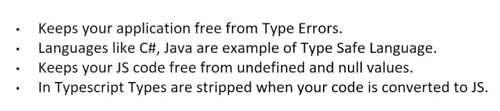

### Angular:
- UI framework built by google
- a component based framework 
- Single Page Application does not make requests to server for every URL requests.
-Angular offers Server Side Rendering.
---

### TypeScript:
- A strongly typed Programming language.
- Created and maintained by Microsoft
- Superset of JavaScript
- Complies down to JavaScript

- Browsers do not understand TypeScript , it is for development purposes only

### DataTypes:

#### `Enums:`
- Enums are a way to define a set of named constants (numeric or string values).
- Numeric Enums automatically assign increasing values starting from 0 (unless specified).
- String Enums explicitly assign string values to enum members.
- Bidirectional Mapping: Enums in TypeScript allow accessing both the name and value (e.g., Day[1] gives "Monday").

### Tuples in TypeScript
- A tuple is an ordered collection of elements, where each element can have a different type. Tuples are similar to arrays, but the types of their elements are known at compile time, and their sizes are fixed.

- Key Features of Tuples:
    - Fixed Length: Tuples have a fixed number of elements.
    - Different Data Types: Each element can have a different data type (e.g., string, number, boolean).
    - Accessing Elements: Elements are accessed by their index, similar to arrays, but the type of each element is checked at compile time.

- any type allows a variable to be assigned any value, bypassing type checking.
    - It is flexible but sacrifices type safety, making the code less predictable.
    - Use any when dealing with unknown or dynamic types (e.g., external data or APIs).

### Types of paramters:
- Optional Parameters are defined with a ? and can be omitted when calling the function.
- Required Parameters must always be provided when calling the function.
- Rest Parameters are represented by ... and allow you to pass any number of arguments, which are treated as an array.
---
- methods with the static keyword can be directly accessed using the class name, without the need to create an instance of the class.

### Decorators
- Decorators are special functions in TypeScript used to add metadata, modify behavior, or extend the functionality of classes, methods, properties, or parameters. They provide a way to apply declarative programming patterns.

